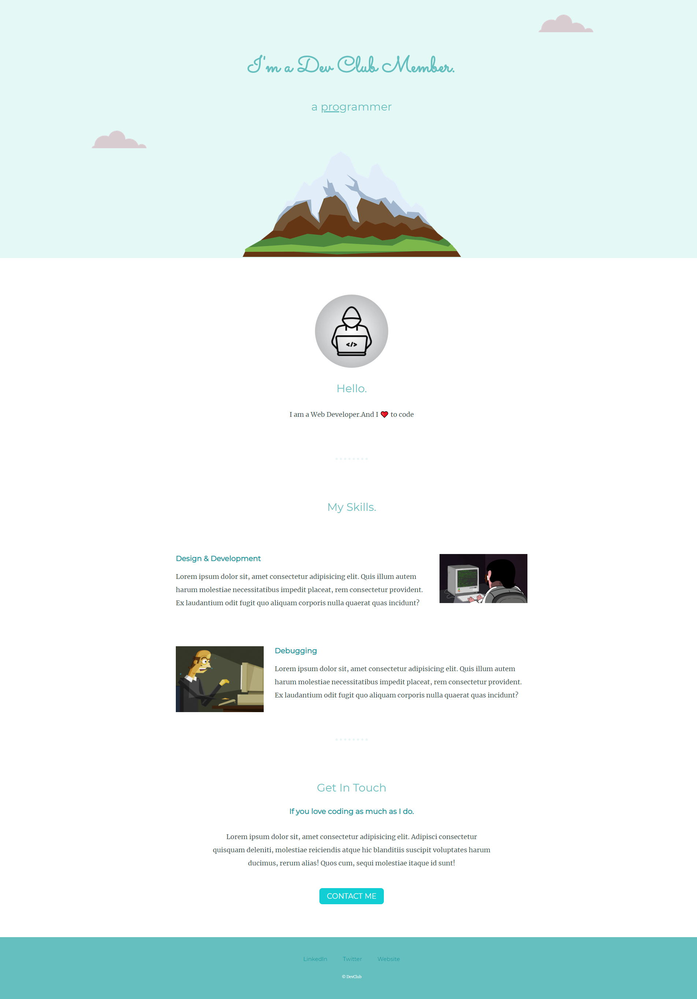

# Personal Site Challenge

> This is the first meeting CSS & HTML challenge -> Personal Site ( you can see a preview in the bottom of the page ).

---

### Table of Contents

- [Challenge Languages](#Languages)
- [Instructions](#Instructions)
- [Style Guide](#Style-Guide)
- [Preview](#Preview)

---

## Languages

* HTML
* CSS

---

## Instructions

- [ ] Clone this repository.
- [ ] Checkout to the starting-files branch
- [ ] Try to mimic the following site ( listed bellow ).

---

## STYLE GUIDE: 

Please fill free to use this style guide to complete the task.

first gif = https://media.giphy.com/media/ZVik7pBtu9dNS/giphy.gif
 
second gif = https://media.giphy.com/media/ukMiDlCmdv2og/giphy.gif 

### Colors: 
    header background = #E4F9F5
    footer background = #66BFBF
    hr and footer text = #EAF6F6
    main text = #40514E
    h1 & h2 = #66BFBF
    h3 =  #11999E
    button =  #11cdd4 => hover = #30e3cb
    button text = white

### Fonts (google font):
    main = 'Merriweather'
    h1 = 'Sacramento'
    h2-6 = 'Montserrat'

### Positions: 
    top cloud = right: 300px, top: 40px
    bottom cloud = left: 250px, bottom: 300px

---

## Preview

